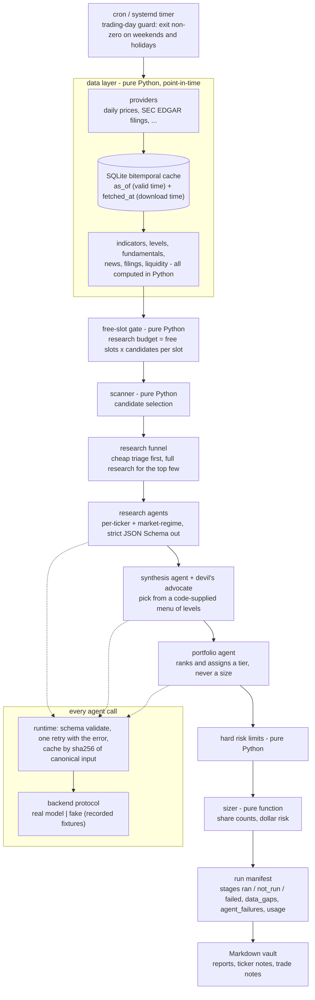

# Swing Trading Research System - showcase

A multi-agent research and decision-support system for US-equity swing trades, and the extracted core
that decides what each run is allowed to know.

**The problem.** Language models are useful for reading a filing, a news tape or a chart summary
and giving a judgement. They are bad at arithmetic, they fill silences with confident guesses, and
the most convincing backtest mistake is lookahead: a "past" run that quietly read data downloaded
later. I wanted a daily research pipeline where every number comes from code, every missing input is
named rather than papered over, and any past session can be replayed with exactly the information
that existed at the time. The system ranks candidates and writes Markdown notes. **It places no
orders and has no execution path**; a person reads the output and trades by hand.

> The full system is in a private repository; I'm happy to walk through it or grant read access during an interview.

## Architecture of the full system



The private system has **23 agents** (14 per-ticker research, 4 market-regime, 2 synthesis, 3
decision/review). One of them is pure Python; the rest return a judgement in a fixed JSON Schema.

## Key technical decisions

**1. Bitemporal storage: `as_of` and `fetched_at` on every row.** A value has two times: the moment
it describes (valid time) and the moment the system downloaded it. A fundamentals payload stamped
last month but pulled today is lookahead for any replay of last month, and only the second
timestamp can say so. Every read takes an `as_of` cut-off; the private backtester reads `fetched_at`
to count each value it had to approximate, and this extraction adds a `known_at=` cut-off so a replay
can refuse those values outright. "Is this fetch lookahead?" is defined against the *market* - a newer session has closed since the stamp - not
against the wall-clock date, so a 07:30 run stamped at yesterday's close still gets its own data.
*Tradeoff:* rows are keyed `(kind, key, as_of)` and a re-fetch overwrites, so the store keeps the
latest download per valid time rather than a full version history. A replay then correctly sees
"not yet known" instead of the restated value, but cannot recover the value as first published.
That was cheaper than an append-only store and has been enough for honest replays.

**2. Python does the math; the model returns JSON.** Indicators, returns, ATR, levels, share
counts and every limit are computed in code. An agent reads a finished table and answers in a strict
JSON Schema; the runtime validates it, feeds the validation error back **once**, and marks the agent
failed on a second miss. Caller-supplied checks go further than a schema can - in the demo, every
number an agent quotes must be one it was given. *Tradeoff:* agents cannot "explore"; anything they
might want has to be computed up front, which costs engineering time on every new input. In return
the numbers in a report are reproducible and a hallucinated price has nowhere to land.

**3. Named gaps instead of silent fills.** A missing source becomes an entry in `data_gaps`; a
failed agent becomes an entry in `agent_failures`; every stage records `ran`, `not_run` or `failed`.
A cross-check refuses a manifest where a blank field has no gap explaining it, or where an agent
failed but every stage claims it ran. *Tradeoff:* reports are noisier and more runs look "partial",
but an empty result can always be told apart from a stage that never executed.

**4. A free-slot gate to cap model cost.** Research is capped at
`free_slots x candidates_per_free_slot` before any agent is called; with no room in the book the
candidate pass is skipped entirely and only open positions are reviewed. Replies are cached by
`(backend, agent, ticker, as_of, sha256 of a canonical input)` - floats rounded to 4 dp and volatile
`fetched_at` stamps dropped - so a same-day re-run is nearly free, and a replay never crosses days.
*Tradeoff:* a good setup can go unresearched on a day the book is full; that is the intended trade of
coverage for cost.

**5. A fake backend for network-free dry runs.** The backend protocol is text in, text out. The
`fake` backend replays recorded JSON fixtures, re-stamps them with the run's `as_of`, never caches
(so a re-recorded fixture is always seen), and fails loudly when a recording is missing. A full dry
run replays a day on fixtures without calling any outside service, and the manifest says
`backend: fake` so a rehearsal can never be mistaken for research. *Tradeoff:* fixtures go stale as
schemas evolve, so they have to be maintained alongside the schemas they are validated against.

## Numbers (from the private repository)

| what | value | how it was counted |
|---|---|---|
| tests | 1,305 collected | `pytest --collect-only -q` |
| test functions | 1,129 | `grep -rE '^\s*(async )?def test_' tests \| wc -l` (parametrize expands them) |
| agents | 23 | agent table in the architecture document |
| Python under `src/` | 29,766 lines | `find src -name '*.py' \| xargs cat \| wc -l` |
| static checks | ruff, mypy `strict = true` | `pyproject.toml` |

## What's in this repo vs. private

| in this repo (`src/swingcore`) | adapted from | kept private |
|---|---|---|
| `bitemporal_cache.py` - SQLite bars and payloads, `as_of` + `fetched_at`, `is_lookahead()` / `lookahead_gap()`, `known_at` replay reads | the data cache | data providers and their integrations, the cache contents |
| `calendar.py`, `trading_day_guard.py` - session arithmetic and the cron guard | calendar utilities and the guard script | - (the real one uses `pandas_market_calendars`; here a **toy** holiday YAML) |
| `llm/` - `Backend` protocol, `FakeBackend`, runtime with schema validation and one retry, canonical cache key | the LLM runtime | the real-model backends, agent configuration (models, efforts, tools), every agent prompt |
| `schemas/run_manifest.json` (trimmed), `manifest.py` - stage recorder and `cross_check` | the run manifest | the research, synthesis, portfolio, risk and post-mortem schemas; decision logic |
| `indicators.py` - SMA, EMA, true range, ATR, trailing returns | the indicator module | scanner, screening criteria, levels, regime logic |
| `demo.py` + `schemas/toy_*.json` + `fixtures/` - **toy** agents on **synthetic** tickers | - | funnel, gate thresholds, risk limits, sizing policy, backtest and calibration results |

Everything labelled toy is a stand-in behind the same interface: `echo_trend_agent` and
`toy_headline_agent`, their schemas, their prompts, the tickers `AAA`/`BBB`, their prices (a seeded
random walk) and their headlines are all made up for the demo.

## Quickstart

Requires Python 3.12.

```bash
python3.12 -m venv .venv && . .venv/bin/activate
pip install -e ".[dev]"

python -m swingcore.demo --dry-run                  # toy cycle, prints the stage table and manifest
python -m swingcore.demo --dry-run --free-slots 0   # the gate closes: research is not_run, nothing is spent
python -m swingcore.trading_day_guard --date 2026-11-26; echo $?   # 1: Thanksgiving

pytest -q
ruff check . && ruff format --check .
mypy                                                 # strict, configured in pyproject.toml
```

The demo runs three stages on two synthetic tickers and fails on purpose twice: `BBB` has no headline
source, so the headline agent is never asked and a data gap names it; and `BBB`'s recorded trend reply
is invalid against its schema, so the runtime retries once, gives up, and the research stage reports
`failed`:

```
run 2026-09-14-morning-dryrun  backend=fake  as_of=2026-09-14T16:30:00-04:00
  data       ran      synthetic bars for 2 tickers; indicators computed in Python
  research   failed   budget 2 = 1 free slot(s) x 2; 3 agent run(s), 1 failed after its one retry
  summary    ran      per-ticker roll-up computed in Python from validated outputs only
  synthesis  not_run  not part of this showcase; the full system runs it
  sizing     not_run  not part of this showcase; the full system runs it
  report     not_run  not part of this showcase; the full system runs it
  FAILED  echo_trend_agent[BBB] at schema: rejected twice: schema 'toy_trend' rejected the output: trend: 'sideways' is not one of ['up', 'down', 'flat']
  GAP     BBB.headlines: insufficient_data: no headline source for this ticker; toy_headline_agent was not asked
  GAP     BBB.summary: no summary: echo_trend_agent produced no valid output
  GAP     BBB.sector: insufficient_data: the data layer returned no sector
```

`deploy/` has an example crontab and a systemd timer/service pair, both gated on the trading-day guard.

## Layout

```
src/swingcore/
  bitemporal_cache.py   calendar.py   trading_day_guard.py   holidays.yaml (toy)
  indicators.py         synthetic.py  models.py              manifest.py
  llm/        base.py  fake.py  runtime.py  cache_key.py
  schemas/    run_manifest.json (trimmed)  toy_trend.json  toy_tone.json
  fixtures/   agents/<agent>/<TICKER>.json   recorded toy replies
  demo.py
tests/        cache, llm, fake backend, manifest, schedule, indicators
deploy/       crontab.example, systemd/
```

## License

MIT - see [LICENSE](LICENSE).
